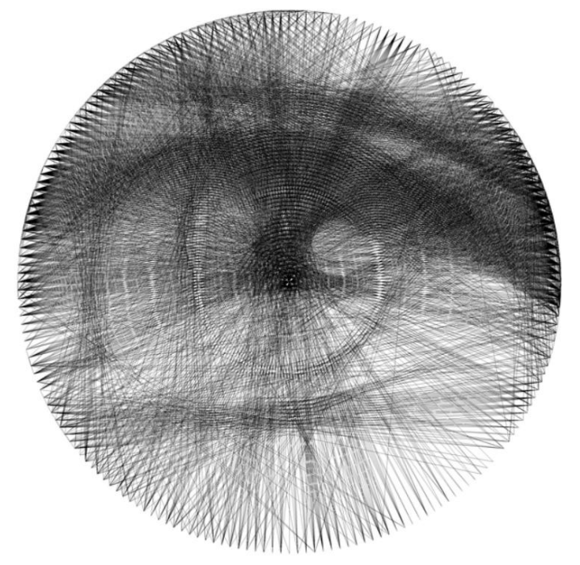
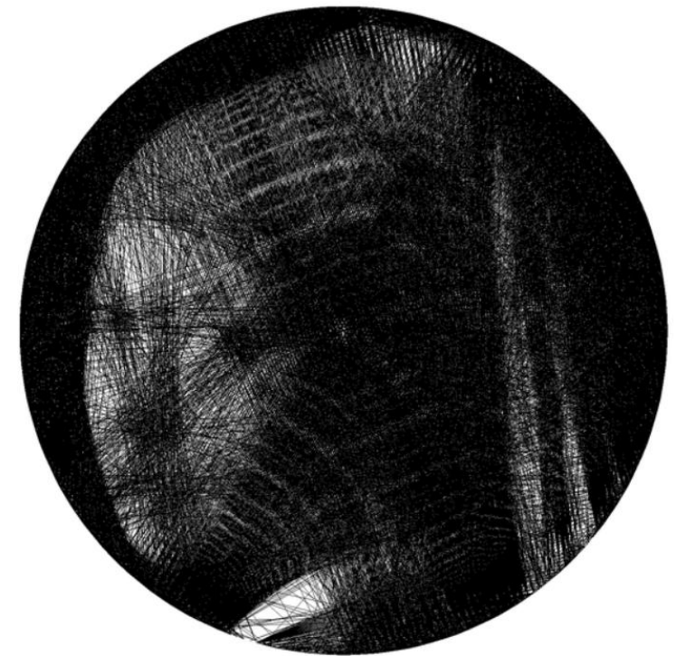
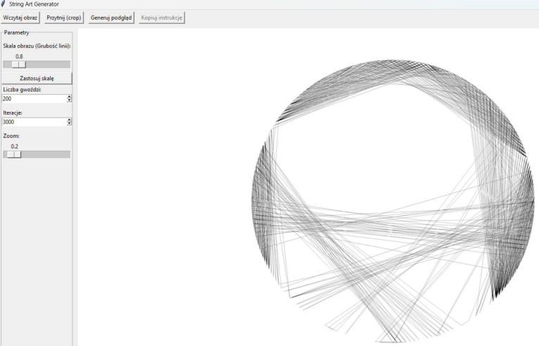

> Note: Some parts of this project and its underlying know-how are not publicly available, as they are intended for future commercial use.

## String Art Generator

Algorithm that converts input images into string threading instructions. Two approaches emerged while coming up with solution both giving different outputs and having different computation times. A simple GUI was made to make experimenting with parameters easier and to achieve this cool timelapse effect you can see below:

 

---

**First method**

This approach was the first thing I came up with while thinking of a solution. I use a different approach right now, but it still has potential, after further optimizations and modifications, to give results for photos that the second algorithm wouldn’t be able to recreate. Either way, it was massively useful to develop, as I learned a whole bunch of practical knowledge about time and space optimizations using different methods like parallel computing on GPUs, broadcasting, precomputing, compressing arrays to sparse matrices and decompressing, and more. Here are some of the outputs:

 

The basic idea is to have a blank canvas and create points that are equally spaced on the circumference of a circle. Then one point is chosen as the starting point, and a line is drawn to every possible connection with that point. The best one is selected by comparing the current canvas to the original photo using MSE. As one can see, this means a huge number of comparisons are made during a run. For a 3000-line piece with 200 points, there are 600,000 MSE comparisons on high-resolution images.

At first, iterations of the algorithm would take days, then hours, and I was finally able to reduce it to about 20 minutes on my computer — which is still quite slow, but at least usable. This improvement was mostly thanks to performing the comparison in the inner loop, where we check for the best line from 200 possibilities. Instead of checking them iteratively, all 200 possibilities are evaluated at once using the GPU. So instead of performing 200 calculations sequentially on the CPU in each iteration, they are done roughly in parallel on the GPU.

This method requires a setup phase. All possible line images need to be precomputed so they can be quickly used in the main loop. It is best described by the diagram below:

Now, in the main loop, new lines are easily accessible, enabling parallel addition of potential lines to the canvas and comparison with the original image. The parallel computation was actually split into two batches because I didn’t have enough GPU memory to compute everything at once.

---
**Second method**

With the second developed approach, I was able to reduce computation time to around 2–3 minutes while achieving much better results. There is still a lot of room for improvement, which I am currently working on. Here are some of the outputs:

  

---
**GUI**

A simple GUI was made to make it easier for user to experiment with different pictures and parameters. It was made using Tkinter library. The timelapse effect was achieved using a custom callback function triggered from the main algorithm loop. Every few iterations (e.g. every 10 lines), the current state of the image is passed to the GUI, which updates the display.

