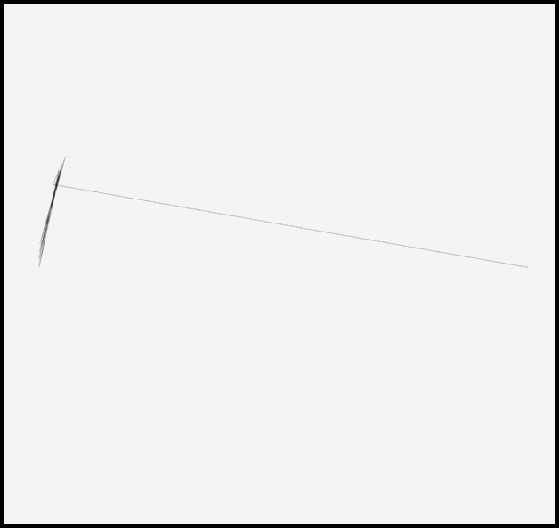
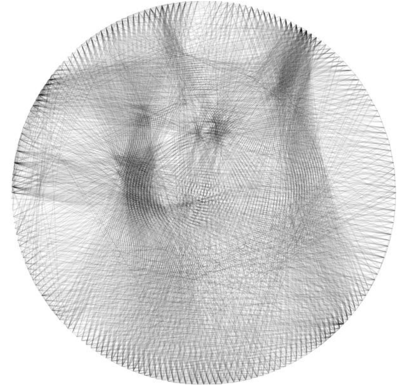
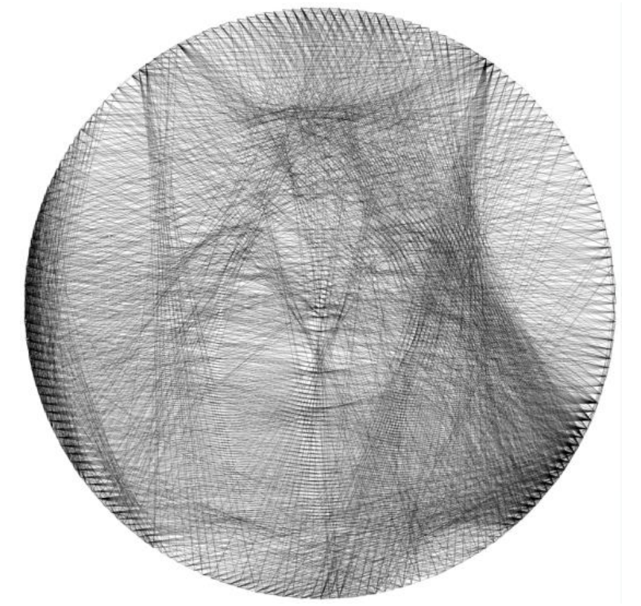
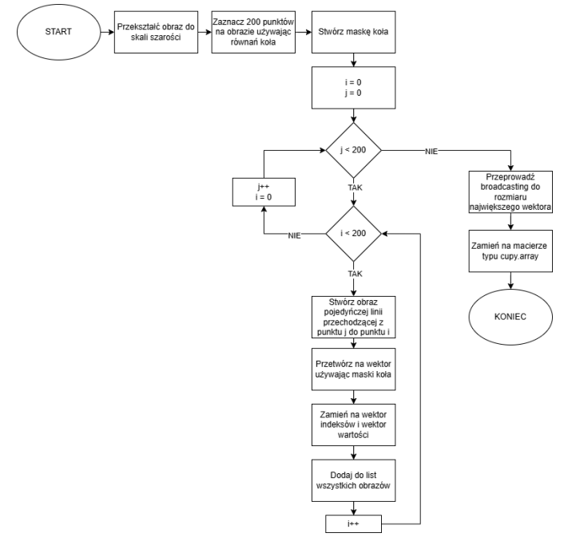

> Note: Some parts of this project and its underlying know-how are not publicly available, as they are intended for future commercial use.

## String Art Generator

Algorithm that converts input images into string threading instructions. Two approaches emerged while coming up with solution both giving different outputs and having different computation times. A simple GUI was made to make experimenting with parameters easier and to achieve this cool timelapse effect you can see below:

 

---

**First method**

This approach was the first thing i came up with while thinking of solution. I use different approach right now but it has potential after further optimalizations and modifications to give solutions for the photos that second algorithm would't be able to recreate. Either way i was massively useful to develop as i learned whole bunch of practiccal knowledge of time and space optimalizations by different methods like parrarel computing using GPUs, broadccating, preccomputing, compresing arrays to sparse matricies and decompresing and more. Here are some of the outputs:

   

Basic idea is to have a blank sheet and create points that are equally spaced on a circumstance of a circle. Then one point is chosen as a first one and a line is written to every possible connection with that point and the best one is chosen by comparing current canvas to orignal photo with MSE. As one can see it means whole bunch of comapasions are made during a run. For 3000 line piece with 200 points there are 600 000 MSE comparasions with really high resolution images.

At first iterations an algorithm would complete in days then hours and i was finally able to make it to abut 20 minutes which still is horrible but at least it was useble. It mostly thanks to making comparasion in inner loop where we check for the best line from 200 possibilities. Instead of checking it iteratively it checks it all at the same time using GPU so instead of having 200 calculations on CPU each iteration 200 calculations are made at roughly the same time on GPU.

This method requires setup. All possible line pictures need to be precomputed to be quicly used in main loop. 

 

**Tech stack:**
- Python
- NumPy / CuPy
- PIL / image processing
- Tkinter

**Features:**
- two different approaches for line selection
- GPU acceleration using CuPy
- precomputation techniques for main loop optimization
- basic GUI for user interaction

**What I learned:**
- performance optimization (time & memory)
- numerical methods and image processing
- designing efficient algorithms
- solving real problem
- using callback functions for progress updates in the GUI
