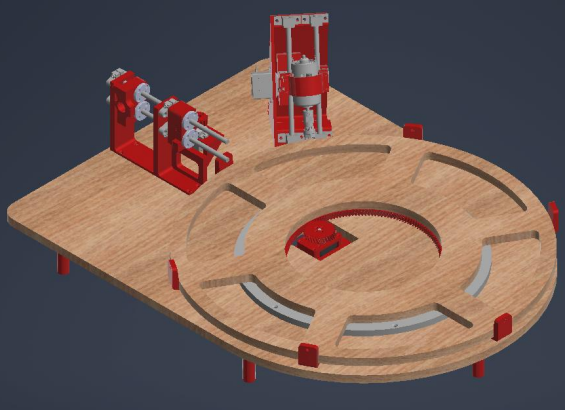
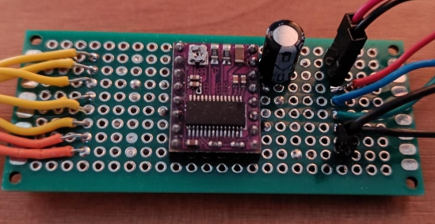
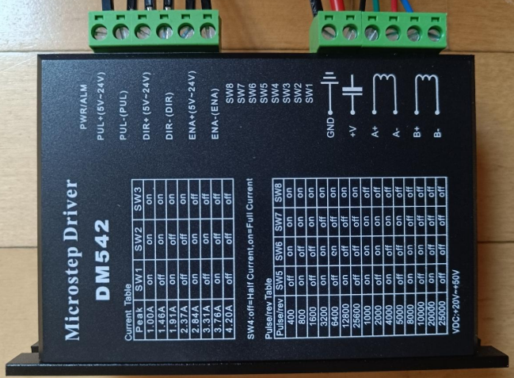
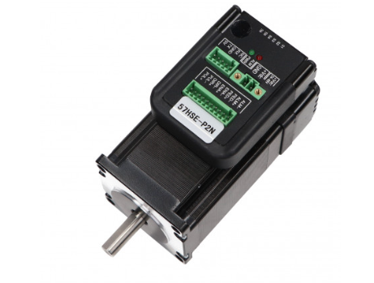
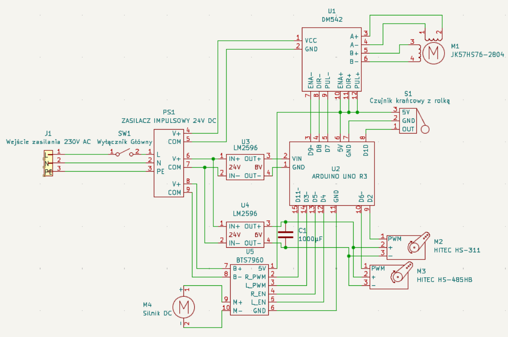

> Note: Some parts of this project and its underlying know-how are not publicly available, as they are intended for future commercial use.

> Note: This is a stripped-down description of the project – there was a lot more content that simply wouldn’t fit here.

---

## String Art Machine

A machine that automates drilling and winding processes to create physical string art pieces. It was developed as part of my engineering thesis at AGH University.

It works by controlling a stepper motor which precisely rotates the frame on which a wooden canvas is mounted. There are two stations: one for drilling holes (to insert nails) and one for winding thread around those nails. The system is controlled using a stepper motor, hobby servos, and dedicated controllers.

The project can be divided into four main parts:
- design  
- electrical scheme & components  
- microcontroller software & control  
- workflow management 
---

**Design**

The design phase was one of the most challenging parts of the project. First, I had to come up with a general concept, so I watched videos of people who built similar machines and drew inspiration from their solutions. Even with that, it was still difficult to develop my own design, as everything had to work together, be cost-effective, and possible to assemble. The last part was crucial, as I often found myself creating solutions that looked great in CAD but were not feasible to assemble in real life. I had to design every part in CAD, keeping in mind that they would be manufactured using 3D printing or CNC machining technologies. Many mistakes were made along the way, but that is how I learned the real challenges of designing functional systems.

Here is the full assembly model created in CAD software:

---

**Electrical scheme & parts**

There were many different components that needed to be purchased, and I had to figure out what exactly I needed and how to connect everything together. I went through a long process of testing various stepper motors and dedicated drivers that turned out not to be suitable for this project. 

At first, I used a small open-loop NEMA 17 stepper motor with a DRV8825 driver.

However, it had too little torque to overcome irregularities in the gear system.

Then I switched to a stronger open-loop NEMA 23 stepper motor with a DM542 driver.

This setup worked much better — the torque was more than sufficient and the driver allowed for smooth operation — but the system still occasionally lost steps.

Finally, I decided to use a more advanced servo-stepper system, which includes an encoder and a built-in dedicated driver.

This solution ultimately allowed the system to operate reliably and achieve the desired performance.

In addition, I had to purchase many other components such as a DC motor with custom collets (used as a screwdriver), a motor driver, elements for building guide rails for both drilling and winding stations, hobby servos, as well as numerous screws, cables, and other hardware.

All electrical components were connected according to a designed electrical scheme shown below:

---

**Microcontroller Software & Control**

When controlling a stepper motor, it is the programmer who defines how fast the motor moves. The shorter the time between impulses, the faster the motor rotates, but the programmer must take into account the motor limitations and the characteristics of the system it is driving. In this case, the driven object has a large inertia, as it is a heavy wooden disc. This means that acceleration requires significantly more torque, while maintaining constant speed requires much less.

To address this, a ramp was implemented — longer delays between impulses during acceleration and deceleration phases, and shorter delays during constant speed. The system was also programmed to precisely move from one pin to another based on instructions generated by the line algorithm, while synchronizing with hobby servos during the winding process.

The DC motor used for drilling was rated for 24V, but direct 24V control was too aggressive and caused the wood to burn. Therefore, it was controlled using a PWM signal to regulate the effective voltage with saturation limits. A timer register was also modified to increase the PWM frequency, as the default Arduino settings were too low and caused the motor to behave in a turbulent and noisy performance.

---

**Workflow Management**

As I was working under a deadline to complete this project, I had to create a schedule to keep everything moving efficiently. I organized the workflow to align with part deliveries and overall progress.

Since I could only work on the machine during weekends at home (and not in the dormitory), I used the remaining time to design parts, make purchases, develop software, and think through solutions to current challenges.

The result was a fully functional system and a 90-page engineering thesis containing a lot of valuable content.

---

**Results**

A repetitive process that would take 10+ hours to complete manually is now fully automated and significantly faster (around 2 hours).

The system operates reliably and consistently, producing repeatable results without manual intervention.

 

