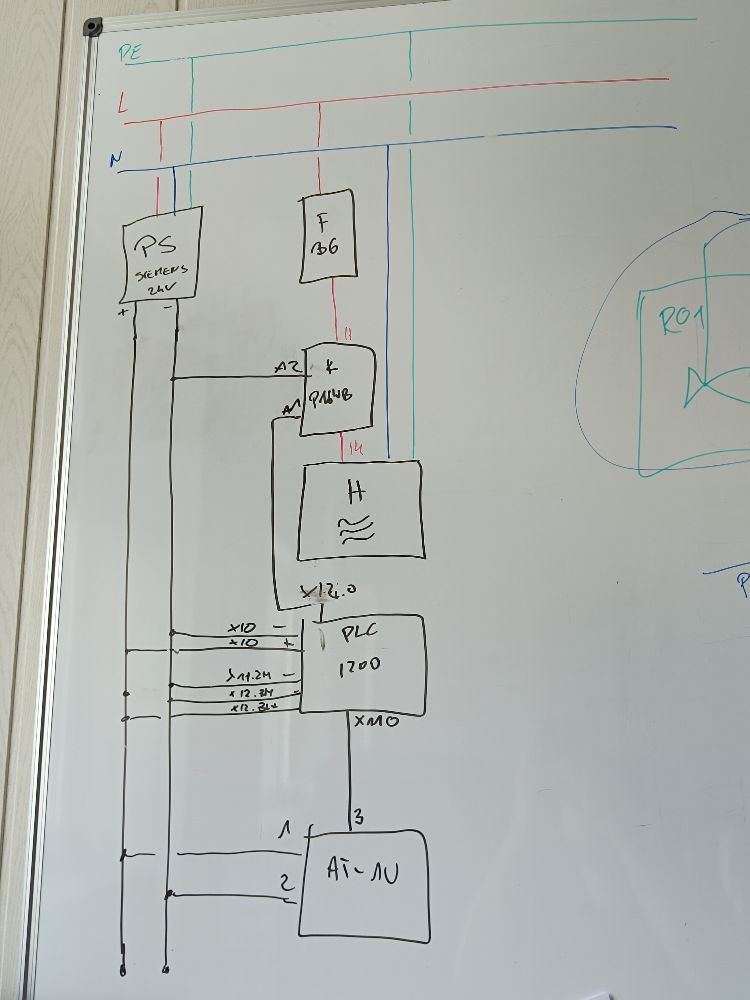
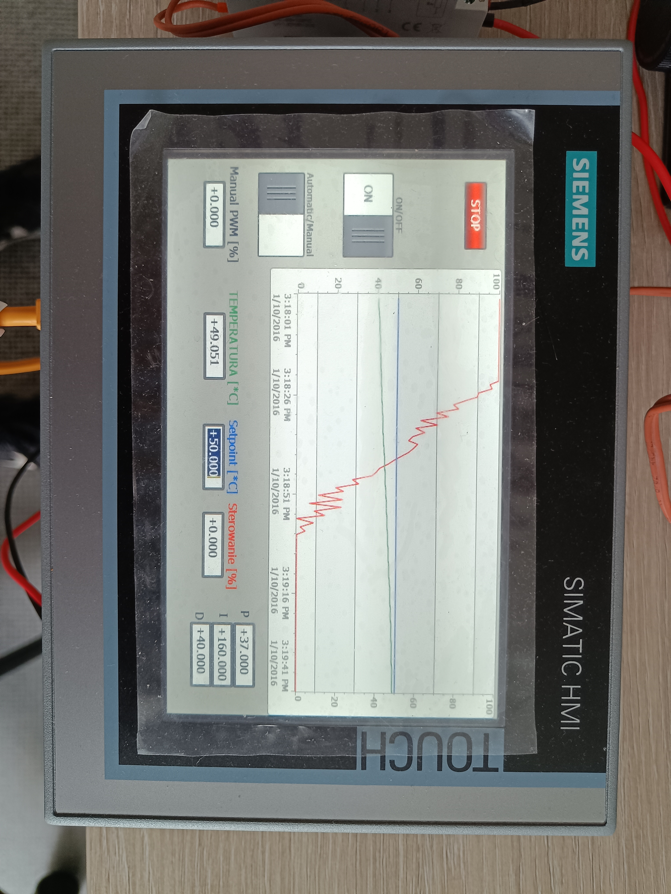
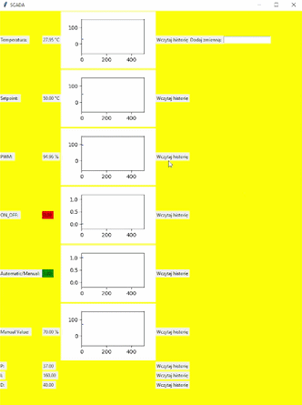

# PLC Python SCADA Integration

This project was developed during my internship at Grupa Azoty Automatyka in Tarnów. It started as a temperature control system with PID control built using a Siemens PLC and HMI, and was later extended with a custom SCADA application written in Python.

Using the snap7 library, I established communication with the PLC and read data directly from DB blocks using direct addressing. The application connected to the controller using its IP, rack, and slot configuration, and then exchanged data with the PLC through `db_read()` and `db_write()` operations.

A simple GUI was built in Tkinter to visualize live data from the PLC and interact with the process. It allowed the user to:
- monitor current PLC values in real time,
- display live plots for selected variables,
- edit writable variables directly from the GUI,
- add or delete variables dynamically,
- view historical data stored in the database.

The system supported both analog and booleanvariables. Analog values were read as raw bytes and converted into types such as `REAL`, while boolean variables were handled at the bit level inside DB blocks.

The whole application was built using object-oriented programming. Variable definitions were stored in a CSV-based tag list, which included information such as variable type, DB number, start byte, byte length, bit number, name, unit, and access mode. This made the system more flexible and easier to expand.

A simple SQL database was also added to store process values over time. This allowed the SCADA application not only to display live data, but also to visualize historical trends.

 

