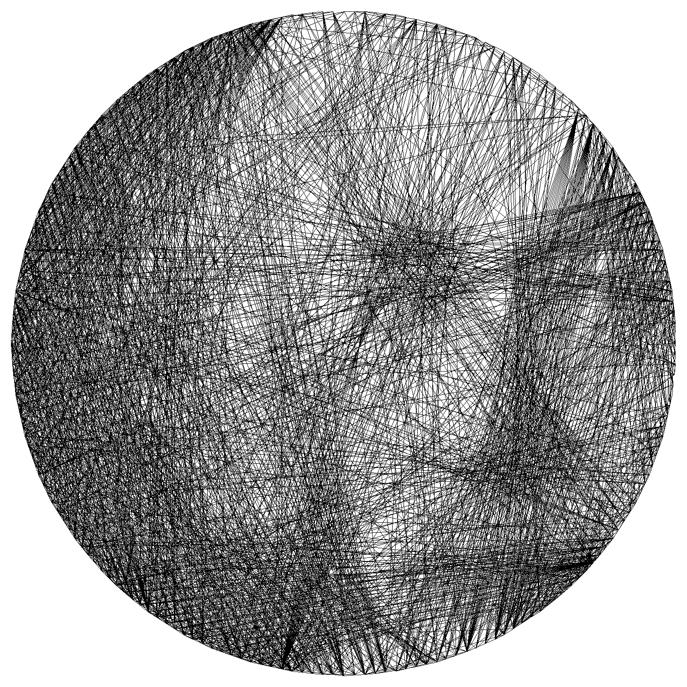
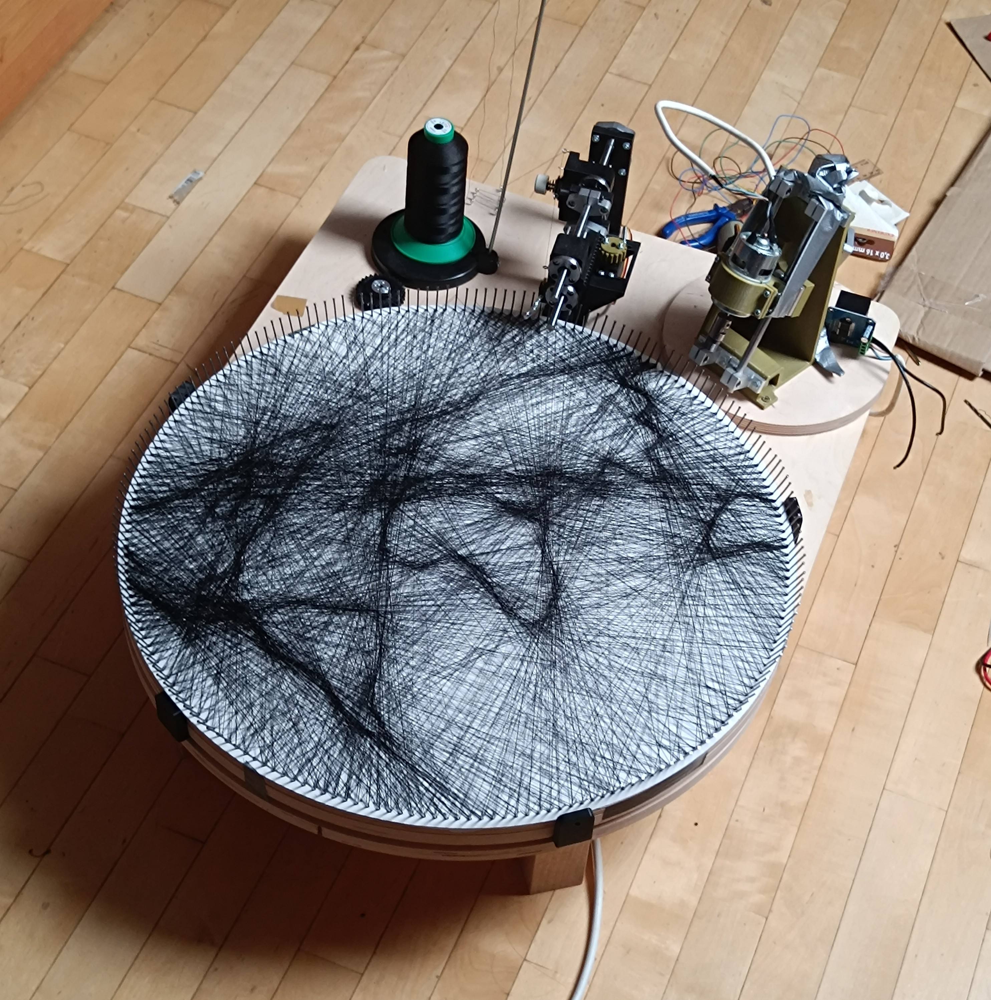
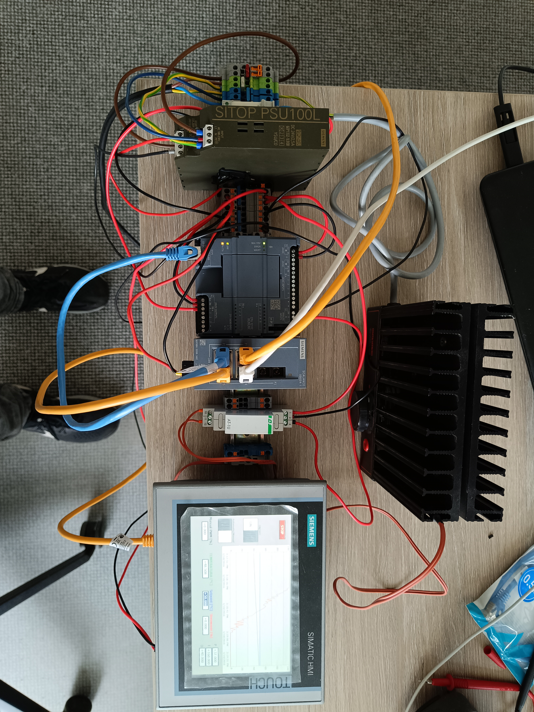
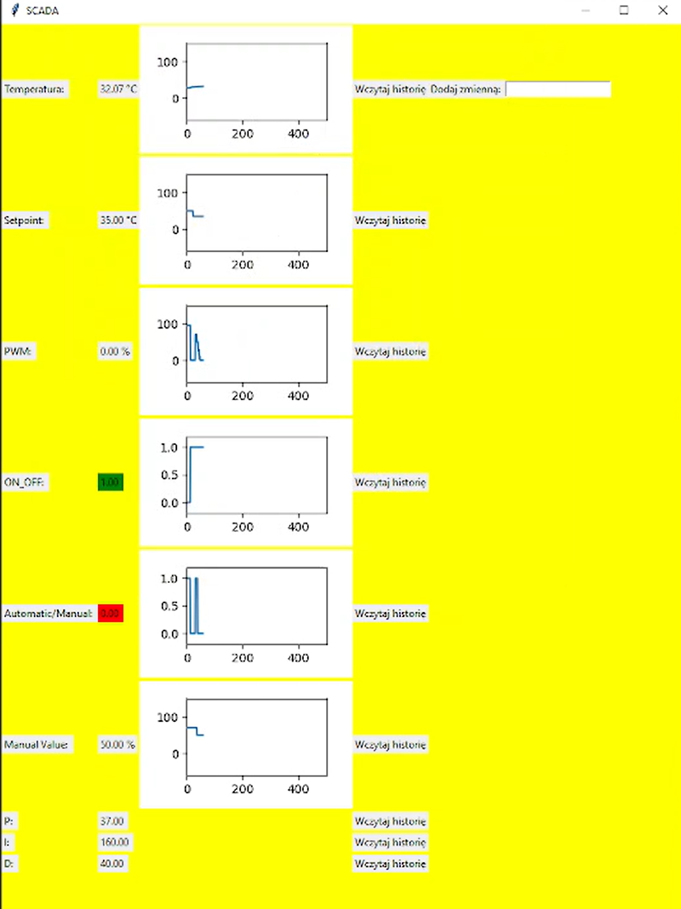
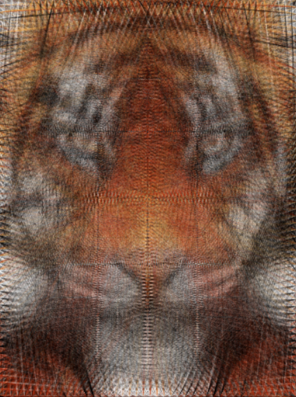
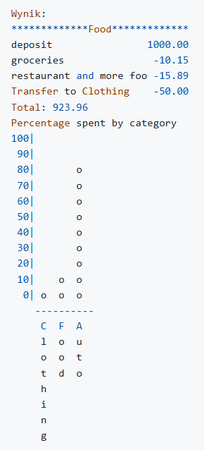
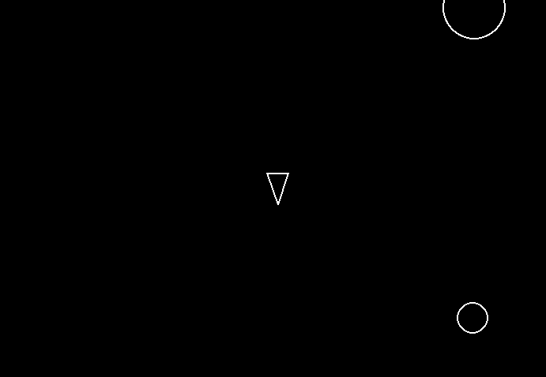

# selected-projects
Repository for showcasing selected projects developed in private repositories

Each project folder contains a detailed description, overview and visuals.

---

## String Art Generator
Algorithm that converts input images into string threading instructions and visualizes result.

 

**Tech stack:**
- Python
- NumPy / CuPy
- PIL / image processing
- Tkinter

**Features:**
- two different approaches for line selection
- GPU acceleration using CuPy
- precomputation techniques for main loop optimization
- basic GUI for user interaction

**What I learned:**
- performance optimization (time & memory)
- numerical methods and image processing
- designing efficient algorithms
- solving real problem
- using callback functions for progress updates in the GUI

👉 [View project](./01-string-art-generator)

---

## String Art Machine
Fully automated system for creating physical string art pieces, developed over 6+ months.

**Tech stack:**
- C++
- Arduino / microcontrollers
- CAD designing
- KiCad

**Features:**
- automated string winding and hole drilling process
- custom-built mechanical system based on servo stepper motor
- integration of electronics, mechanics and control logic

**What I learned:**
- designing components for CNC machining and 3D printing
- developing a complete system to solve a real-world problem
- performing engineering calculations
- efficient control of stepper and servo motors
- working with real-world constraints (mechanics, electronics)
- developing microcontroller software
- designing electrical schematics
- selecting and sourcing appropriate components
- coming up with creative solutions to problems
- planning and managing workflow, including hardware deliveries

👉 [View project](./02-string-art-machine)

---

## PLC–Python SCADA Integration
Industrial control system with a custom SCADA application developed in Python.

 

**Tech stack:**
- Siemens PLC (TIA Portal)
- Python
- SQL database
- snap7

**Features:**
- real-time data acquisition from PLC
- data storage and visualization
- custom SCADA interface
- calibratied control system using PID regulation
- HMI panel

**What I learned:**
- PLC–software integration
- tuning PID controllers using the Ziegler–Nichols method
- industrial communication protocols
- building simple SCADA systems from scratch
- managing database
- designing HMI panels

👉 [View project](./03-plc-python-scada-integration)

---

## Coloured String Art
Extension of the string art algorithm to support full-color image processing.

**Tech stack:**
- Python
- NumPy / CuPy

**Features:**
- color-based string art generation
- improved output quality by incorporating HSV color space

**What I learned:**
- working with color spaces
- improving algorithm output through experimentation

---

## Projects from Courses
Collection of smaller projects developed during Boot.dev and FreeCodeCamp courses.

 

**Tech stack:**
- Python

**Features:**
- fundamental programming exercises
- data structures & algorithms
- small applications and utilities

**What I learned:**
- core computer science and programming concepts
- object-oriented programming
- functional programming principles
- data structures & algorithms
- problem-solving and algorithmic thinking
- integrating Gemini API to build primitive AI agent

👉 [View projects](./projects-from-courses)

